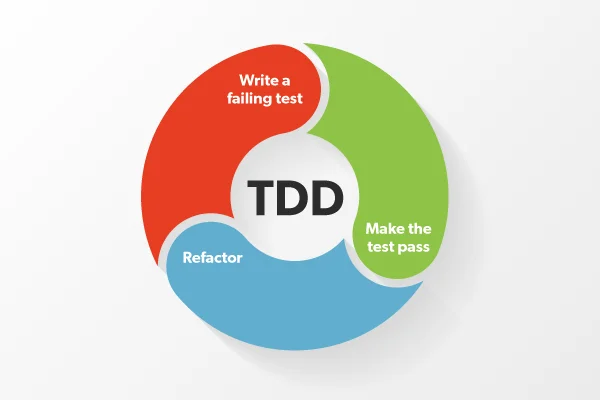

# TDD Workshop
Test Driven Development

---

# What are the steps in TDD?

First set things up:
* Create empty function
* List out all the test cases (without writing the tests yet)

---

# What are the steps in TDD?

* Start by writing one of the simplest test cases
* Run that test - expecting it to fail
* Make the smallest change in the code to pass the test
* Run the test again - expecting it to pass
* If needed, refactor the code, and re-run the tests
* Repeat

---

# What are the steps in TDD?

---

# But, why?
What is the value in TDD? Why are we doing it?
* makes the developer focus on requirements ***before*** writing code
* focusing on writing ***only the code necessary*** to pass tests - can lead to cleaner and clearer code
* ensures that the code is written for testability from the beginning, instead of worrying how to test it later

---

# Now what?

* practice
* use TDD in your projects
* add TDD to your CV
* be able to explain what the steps are
* be able to explain what the value is
